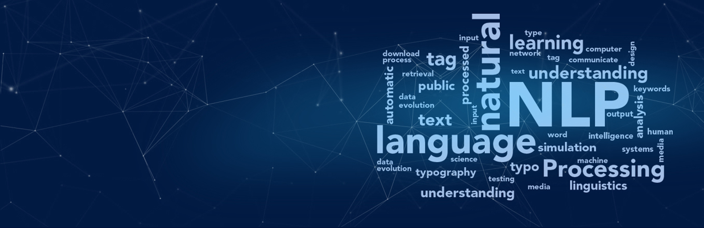

## Desafío 1: Word2vect
OHE, CountFrequency, TfIdf. Método de comparación de documentos por similitud
[Ver notebook de este desafío](https://colab.research.google.com/drive/1E_pIB6j30UzoByNJhbS0-bqxF4h8FPmn?usp=sharing)

## Desafío 2: Chatbot simple
Chattbot con una heurística muy simple
[Ver notebook de este desafío](https://colab.research.google.com/drive/1vHH7WSsANmCtZDITAiK81e93erFf6Tjf?usp=sharing)

## Desafío 3: Chatbot Wikipedia
Chatbot  entrenado con una página de wikipedia. Procesamiento de los datos con NLTK. 
[Ver notebook de este desafío](https://colab.research.google.com/drive/1M-4texre_K1Ux3cgsjwHNGas5sWISPf-?usp=sharing)

## Desafío 4: Custom embeddings con Gensim
Embeddings entrenados con dataset de recetas. 
[Ver notebook de este desafío](https://colab.research.google.com/drive/1MQykyHK9AUE9Vzh7Vs7Ri4qqplsekYfY?usp=sharing)

## Desafío 5: Predicción de palabras
Language model entrenado con data de twitter
[Ver notebook de este desafío](https://colab.research.google.com/drive/1aQFRjfydij0_G-Yel1fPBLrjZcsHRtU8?usp=sharing)

## Desafío 6: Clothing e-commerce reviews
Embeddings + lstm: Modelo de clasificación múltiple de ratings de productos.
[Ver notebook de este desafío](https://colab.research.google.com/drive/1VvCvm0aw_jwkx_V7pU7dcU4y908JWBXb?usp=sharing)

## Desafío 7: Bot QA
Encoder decoder: QA system con data de convai
[Ver notebook de este desafío](https://colab.research.google.com/drive/1Bvn-vzB3211xKw0g5Plvxig4iWz8Nzo2?usp=sharing)

